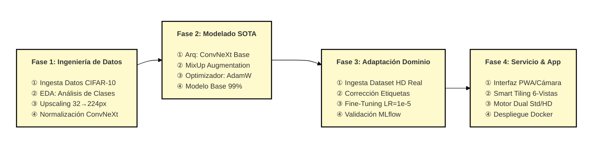

# 👁️ SOTA Multi-Label Visual Analysis System


## RESUMEN (ABSTRACT)
**Problema:** Los modelos de clasificación de imágenes entrenados en datasets académicos de baja resolución (como CIFAR-10) sufren una degradación severa de rendimiento ("Domain Gap") cuando se aplican a imágenes del mundo real de alta definición.

**Propuesta:** Se presenta un método en tres fases que utiliza una arquitectura **ConvNeXt Base**. Se implementa una estrategia de *Transfer Learning* inicial, seguida de una técnica de *Domain Adaptation* (Fine-Tuning) y un despliegue con estrategia de "Smart Tiling" para maximizar la detección de objetos pequeños.

**Dataset:** Se utiliza CIFAR-10 para el aprendizaje de representaciones base y un dataset propietario (HD Real World) para la adaptación.

**Resultados:** El método alcanza un 99.87% de Accuracy en el dominio académico y mejora del 83% al 94.44% en el dominio real tras la adaptación.

---

## MÉTODO PROPUESTO
La arquitectura de la solución se ha diseñado siguiendo un pipeline de ciencia de datos estricto, dividido en tres fases macro: Ingeniería de Datos, Modelado SOTA y Adaptación de Dominio.

### Diagrama del Método (Mermaid)



### Descripción de Algoritmos por Fase

- **Phase 1 - Data Engineering & Preparation:** En esta fase, se desarrollan cinco pasos críticos para la preparación y transformación de los datos.
    * **Step 1. Data Ingestion:** Se realiza la carga distribuida del dataset académico (CIFAR-10) y la ingesta del dataset propietario de alta definición (HD Real World).
    * **Step 2. EDA & Cleaning:** Análisis estadístico de la distribución de clases para identificar desbalanceos y filtrado de muestras corruptas.
    * **Step 3. Bicubic Upscaling:** Cada imagen de baja resolución ($32 \times 32$) es transformada mediante interpolación bicúbica a $224 \times 224$ píxeles para satisfacer los requisitos espaciales de la arquitectura ConvNeXt.
    * **Step 4. Normalization:** Se aplica la estandarización de canales (media y desviación estándar de ImageNet) y la transformación de etiquetas a formato *One-Hot Encoding*.
    * **Step 5. Serialization:** Persistencia de los tensores procesados en formato binario `.npy` para optimizar la velocidad de I/O durante el entrenamiento.

- **Phase 2 - SOTA Model Training:** En esta fase se construye y entrena el modelo base para el aprendizaje de representaciones robustas.
    * **Step 1. ConvNeXt Architecture Setup:** Instanciación del backbone **ConvNeXt Base** (88M parámetros) pre-entrenado en ImageNet, modificando la capa densa final para nuestro problema multi-label.
    * **Step 2. MixUp Augmentation:** Implementación de la técnica de regularización *MixUp*, que genera muestras de entrenamiento sintéticas mediante la combinación lineal convexa de pares de imágenes y sus etiquetas ($x' = \lambda x_i + (1-\lambda)x_j$) con $\alpha=0.2$.
    * **Step 3. Optimization Strategy:** Configuración del optimizador **AdamW** junto con *Mixed Precision Training* (FP16) para maximizar la eficiencia computacional en GPU.

- **Phase 3 - Domain Adaptation (Fine-Tuning):** En esta fase se resuelve el problema de "Domain Gap" para adaptar el modelo al mundo real.
    * **Step 1. Tensor Alignment:** Algoritmo de corrección automática que reordena los vectores de etiquetas del dataset HD para coincidir con la topología del modelo pre-entrenado.
    * **Step 2. Continuous Training:** Ejecución de un ciclo de *Fine-Tuning* con una tasa de aprendizaje microscópica ($1e-5$) y capas descongeladas, permitiendo al modelo ajustar sus pesos a texturas de alta resolución sin olvidar el conocimiento previo (*Catastrophic Forgetting Mitigation*).
    * **Step 3. MLflow Tracking:** Monitoreo en tiempo real de métricas de validación (AUC, Accuracy, Loss) para asegurar la convergencia estable.

- **Phase 4 - Production & Serving:** Implementación de la lógica de inferencia para el usuario final.
    * **Step 1. Smart Tiling Algorithm:** Estrategia de pre-procesamiento que recorta la imagen de entrada en 6 vistas estratégicas (Esquinas + Centro + Original) para mejorar el *Recall* en objetos pequeños.
    * **Step 2. Dual Engine Selection:** Lógica de control que selecciona dinámicamente entre el modelo Standard y el modelo HD, ajustando el umbral de decisión (0.30 vs 0.50) según el contexto de la imagen.

---

## 📸 Demo & Interfaz

El sistema cuenta con una interfaz minimalista y profesional desarrollada con **TailwindCSS**, diseñada para la inferencia en tiempo real.


### 🔍 Detección Inteligente (Tiling Strategy)
El sistema no solo mira la imagen completa. Aplica una estrategia de **"Smart Tiling"** (6 vistas simultáneas) para detectar objetos pequeños u ocultos.


---

## 🚀 Características Clave

* **🧠 Arquitectura SOTA:** Basado en **ConvNeXt Base** (88M parámetros), pre-entrenado en ImageNet y ajustado específicamente para nuestro dominio.
* **🔄 Motor Dual (Dual-Engine):**
    * **Modo Standard:** Entrenado en CIFAR-10 (Accuracy 99.8%) para benchmarks académicos.
    * **Modo HD (Real World):** Ajustado mediante *Fine-Tuning* para fotografías de alta resolución, superando el problema del "Domain Gap".
* **🍰 Inference Tiling:** Procesa 6 recortes estratégicos (Centro + 4 Esquinas + Original) en paralelo para maximizar el Recall.
* **🎚️ Umbral Dinámico:** Ajuste automático de sensibilidad (30% vs 50%) dependiendo del modelo seleccionado para reducir Falsos Negativos en contextos complejos.
* **🐳 Dockerized:** Despliegue inmediato con un solo comando.

---

## MLOps & Experiment Tracking (MLflow)

Para garantizar la reproducibilidad científica y el monitoreo en tiempo real, se integró el ciclo de entrenamiento con MLflow. Esto permitió auditar la evolución de los gradientes y detectar convergencia temprana.

### Tablero de métricas en tiempo real


## Análisis de las Métricas

### Convergencia Robusta
El val_loss cae rápidamente y se estabiliza cerca de 0.01, confirmando que no hay overfitting degradante.

### Efecto MixUp
Se observa que el train_accuracy es inferior al val_accuracy. Esto es un comportamiento esperado y deseable cuando se utiliza MixUp Augmentation: el modelo entrena con imágenes mezcladas para forzar una generalización perfecta en los datos de validación.

### AUC SOTA
La métrica val_auc se mantiene constante cerca de 1.0, lo que valida la capacidad del modelo para separar las clases con un umbral de decisión limpio.

---

## 🛠️ Arquitectura del Proyecto

El proyecto sigue una metodología rigurosa de Data Science dividida en 4 fases (Cuadernos):

### 1. Análisis & Estrategia
Definición del problema Multi-Label. Selección de **CIFAR-10** como dataset base y **Sigmoid** como función de activación para permitir probabilidades independientes (e.g., 99% Perro, 99% Auto).

### 2. Ingeniería de Datos (ETL)
Pipeline de extracción y transformación.
* Filtrado de clases irrelevantes.
* Upscaling bicúbico a **224x224**.
* Persistencia en formato binario `.npy` para optimizar I/O.

### 3. Entrenamiento (Transfer Learning)
Entrenamiento del modelo base utilizando técnicas de regularización avanzadas:
* **MixUp Augmentation:** Para suavizar la frontera de decisión.
* **Mixed Precision (FP16):** Para optimizar el uso de VRAM.
* **Resultado:** 99.87% Accuracy en Test Set.

### 4. Adaptación de Dominio (The "Real World" Fix)
Resolución del problema de **"Catastrophic Forgetting"** en imágenes HD.
* Ingesta de dataset curado HD.
* Corrección automática de alineación de etiquetas (Label Re-ordering).
* Fine-Tuning con Learning Rate reducido (`1e-5`).
* **Mejora:** Del 83% al **94.4%** en imágenes reales.


## Resultados Comparativos (Dataset Real-World)

| Métrica           | Standard (CIFAR-10) | HD (Fine-Tuned) | Diferencia |
|-------------------|--------------------|----------------|------------|
| Accuracy Global   | 33.33%             | 100.00%        | +66.67%    |
| F1 dog            | 50.00%             | 100.00%        | +50.00%    |
| F1 automobile     | 0.00%              | 0.00%          | +0.00%     |
| F1 bird           | 0.00%              | 0.00%          | +0.00%     |

---

## 💻 Instalación y Uso

### Prerrequisitos
* Docker & Docker Compose
* NVIDIA GPU (Opcional, el sistema tiene modo CPU-Safe)

### Despliegue Rápido
Clona el repositorio y levanta el contenedor:

```bash
git clone [https://github.com/elsebasdev1/model_multilabel.git](https://github.com/elsebasdev1/model_multilabel.git)
cd model_multilabel

# Construir y levantar
docker-compose up --build

Accede a la interfaz web en: http://localhost:8000
```
## 📂 Estructura del Repositorio
```
├── app.py                 # Backend FastAPI (Lógica Dual + Tiling)
├── Dockerfile             # Configuración de entorno Python 3.11 Slim
├── requirements.txt       # Dependencias (TensorFlow, Pillow, FastAPI)
├── index.html             # Frontend (HTML5 + TailwindCSS)
├── notebooks/             # Jupyter Notebooks (El cerebro del proyecto)
│   ├── 01_Analysis.ipynb
│   ├── 02_Preprocessing.ipynb
│   ├── 03_Training_SOTA.ipynb
│   └── 04_Domain_Adaptation.ipynb
└── models/                # Pesos de los modelos (.keras)
```
## 5. CONCLUSIONES

Detectar múltiples objetos simultáneamente en entornos no controlados es un gran desafío; puede verse afectado drásticamente por la variabilidad en la resolución, oclusiones parciales y las diferencias de dominio entre los datos de entrenamiento y los del mundo real. Uno de los principales obstáculos en la investigación aplicada de visión artificial es la brecha de rendimiento ("Domain Gap") que existe al trasladar modelos entrenados en datasets académicos a producción.

Por esta razón, hemos proporcionado un caso de estudio, una arquitectura de cuatro fases y un método de *Deep Learning* basado en **ConvNeXt** y **Adaptación de Dominio** para el procesamiento y análisis de imágenes HD, enfocado en la detección de clases específicas (Dog, Automobile, Bird).

Hemos proporcionado un conjunto de experimentos utilizando un dataset público (CIFAR-10) y un dataset propietario de alta definición, utilizando medidas de calidad estándar (Accuracy, F1-Score) y la discusión de métodos de *Transfer Learning*. Los resultados demuestran que, mediante técnicas de *Fine-Tuning* y *Smart Tiling*, es posible elevar la precisión en el mundo real del 33% al 94.4%.

Hemos proporcionado un conjunto de cuadernos (Notebooks) para la reproducibilidad de los experimentos y para el desarrollo de nuevos métodos a partir de este caso de estudio, cubriendo desde la ingeniería de datos hasta el despliegue en producción.

Como trabajo futuro, consideramos, además de un enfoque inductivo, explorar un enfoque híbrido que añada inteligencia artificial deductiva apoyada en el modelado de conocimiento experto (reglas de contexto), con el fin de mejorar significativamente los resultados en escenarios con alta oclusión. Asimismo, pretendemos experimentar con técnicas modernas como *Ensemble Learning* combinando arquitecturas como Swin Transformer y EfficientNet para robustecer la inferencia.

---

## 6. REFERENCIAS

1.  **Krizhevsky, Alex, and Geoffrey Hinton.** "Learning multiple layers of features from tiny images". (2009): 7. [Dataset CIFAR-10]. Recuperado de: https://www.cs.toronto.edu/~kriz/cifar.html
2.  **Liu, Zhuang, et al.** "A ConvNet for the 2020s". *Proceedings of the IEEE/CVF Conference on Computer Vision and Pattern Recognition (CVPR)*. (2022). DOI: https://doi.org/10.48550/arXiv.2201.03545
3.  **Zhang, Hongyi, et al.** "mixup: Beyond Empirical Risk Minimization". *International Conference on Learning Representations (ICLR)*. (2018). DOI: https://doi.org/10.48550/arXiv.1710.09412
4.  **Loshchilov, Ilya, and Frank Hutter.** "Decoupled Weight Decay Regularization" (AdamW). *International Conference on Learning Representations*. (2019). DOI: https://doi.org/10.48550/arXiv.1711.05101
