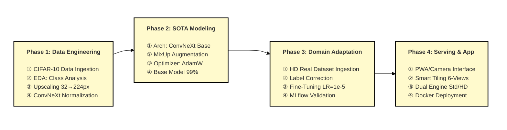

> 🌐 **Change Language:** [Spanish](README_ES.md)
# 👁️ SOTA Multi-Label Visual Analysis System


## ABSTRACT
**Problem:** Image classification models trained on low-resolution academic datasets (such as CIFAR-10) suffer from severe performance degradation ("Domain Gap") when applied to high-definition real-world images.

**Proposal:** A three-phase method using a **ConvNeXt Base** architecture is presented. An initial *Transfer Learning* strategy is implemented, followed by a *Domain Adaptation* (Fine-Tuning) technique and a deployment with a "Smart Tiling" strategy to maximize small object detection.

**Dataset:** CIFAR-10 is used for base representation learning and a proprietary dataset (HD Real World) is used for adaptation.

**Results:** The method achieves 99.87% Accuracy in the academic domain and improves from 83% to 94.44% in the real domain after adaptation.

---

## PROPOSED METHOD
The solution architecture has been designed following a strict data science pipeline, divided into three macro phases: Data Engineering, SOTA Modeling, and Domain Adaptation.

### Method Diagram (Mermaid)


```mermaid
%%{init: {'theme':'base', 'themeVariables': { 'fontSize':'14px'}}}%%
graph LR
    subgraph ROW1[" "]
        direction LR
        A1["<b>Phase 1: Data Engineering</b><br/><br/>① CIFAR-10 Data Ingestion<br/>② EDA: Class Analysis<br/>③ Upscaling 32→224px<br/>④ ConvNeXt Normalization"]
        A2["<b>Phase 2: SOTA Modeling</b><br/><br/>① Arch: ConvNeXt Base<br/>② MixUp Augmentation<br/>③ Optimizer: AdamW<br/>④ Base Model 99%"]
    end
    
    subgraph ROW2[" "]
        direction LR
        B1["<b>Phase 3: Domain Adaptation</b><br/><br/>① HD Real Dataset Ingestion<br/>② Label Correction<br/>③ Fine-Tuning LR=1e-5<br/>④ MLflow Validation"]
        B2["<b>Phase 4: Serving & App</b><br/><br/>① PWA/Camera Interface<br/>② Smart Tiling 6-Views<br/>③ Dual Engine Std/HD<br/>④ Docker Deployment"]
    end
    
    A1 --> A2
    A2 --> B1
    B1 --> B2
    
    ROW1 ~~~ ROW2
    
    style A1 fill:#FFFACD,stroke:#000,stroke-width:2px,text-align:left
    style A2 fill:#FFFACD,stroke:#000,stroke-width:2px,text-align:left
    style B1 fill:#FFFACD,stroke:#000,stroke-width:2px,text-align:left
    style B2 fill:#FFFACD,stroke:#000,stroke-width:2px,text-align:left
    style ROW1 fill:none,stroke:none
    style ROW2 fill:none,stroke:none
```

### Algorithm Description by Phase

- **Phase 1 - Data Engineering & Preparation:** In this phase, five critical steps for data preparation and transformation are developed.
    * **Step 1. Data Ingestion:** Distributed loading of the academic dataset (CIFAR-10) and ingestion of the proprietary high-definition dataset (HD Real World).
    * **Step 2. EDA & Cleaning:** Statistical analysis of class distribution to identify imbalances and filtering of corrupted samples.
    * **Step 3. Bicubic Upscaling:** Each low-resolution image ($32 \times 32$) is transformed via bicubic interpolation to $224 \times 224$ pixels to meet the spatial requirements of the ConvNeXt architecture.
    * **Step 4. Normalization:** Channel standardization (ImageNet mean and standard deviation) and label transformation to *One-Hot Encoding* format.
    * **Step 5. Serialization:** Persistence of processed tensors in binary `.npy` format to optimize I/O speed during training.

- **Phase 2 - SOTA Model Training:** In this phase, the base model is built and trained for robust representation learning.
    * **Step 1. ConvNeXt Architecture Setup:** Instantiation of the **ConvNeXt Base** backbone (88M parameters) pre-trained on ImageNet, modifying the final dense layer for our multi-label problem.
    * **Step 2. MixUp Augmentation:** Implementation of the *MixUp* regularization technique, which generates synthetic training samples through convex linear combinations of image pairs and their labels ($x' = \lambda x_i + (1-\lambda)x_j$) with $\alpha=0.2$.
    * **Step 3. Optimization Strategy:** Configuration of the **AdamW** optimizer together with *Mixed Precision Training* (FP16) to maximize computational efficiency on GPU.

- **Phase 3 - Domain Adaptation (Fine-Tuning):** In this phase, the "Domain Gap" problem is addressed to adapt the model to real-world data.
    * **Step 1. Tensor Alignment:** Automatic correction algorithm that reorders HD dataset label vectors to match the topology of the pre-trained model.
    * **Step 2. Continuous Training:** Execution of a *Fine-Tuning* cycle with a microscopic learning rate ($1e-5$) and unfrozen layers, allowing the model to adapt to high-resolution textures without forgetting prior knowledge (*Catastrophic Forgetting Mitigation*).
    * **Step 3. MLflow Tracking:** Real-time monitoring of validation metrics (AUC, Accuracy, Loss) to ensure stable convergence.

- **Phase 4 - Production & Serving:** Implementation of inference logic for the end user.
    * **Step 1. Smart Tiling Algorithm:** Pre-processing strategy that crops the input image into 6 strategic views (Corners + Center + Original) to improve recall on small objects.
    * **Step 2. Dual Engine Selection:** Control logic that dynamically selects between the Standard model and the HD model, adjusting the decision threshold (0.30 vs 0.50) according to image context.

---

## 📸 Demo & Interface
The system features a minimalist and professional interface developed with **TailwindCSS**, designed for real-time inference.


### 🔍 Smart Detection (Tiling Strategy)
The system does not only analyze the full image. It applies a **Smart Tiling** strategy (6 simultaneous views) to detect small or hidden objects.


---

## 🚀 Key Features
* **🧠 SOTA Architecture:** Based on **ConvNeXt Base** (88M parameters), pre-trained on ImageNet and specifically adapted for our domain.
* **🔄 Dual Engine:**
    * **Standard Mode:** Trained on CIFAR-10 (99.8% Accuracy) for academic benchmarks.
    * **HD Mode (Real World):** Fine-tuned on high-resolution photography, overcoming the Domain Gap.
* **🍰 Inference Tiling:** Processes 6 strategic crops (Center + 4 Corners + Original) in parallel to maximize recall.
* **🎚️ Dynamic Threshold:** Automatic sensitivity adjustment (30% vs 50%) depending on the selected model to reduce false negatives.
* **🐳 Dockerized:** One-command deployment.

---

## MLOps & Experiment Tracking (MLflow)
To ensure scientific reproducibility and real-time monitoring, the training cycle was integrated with MLflow, enabling auditing of gradient evolution and early convergence detection.

### Real-time Metrics Dashboard


## Metrics Analysis
### Robust Convergence
The validation loss drops rapidly and stabilizes around 0.01, confirming the absence of degrading overfitting.

### MixUp Effect
Training accuracy is lower than validation accuracy, which is expected and desirable when using MixUp augmentation, as it enforces stronger generalization.

### SOTA AUC
The validation AUC remains close to 1.0, validating strong class separability.

---

## 🛠️ Project Architecture
The project follows a rigorous Data Science methodology divided into four phases (Notebooks):

### 1. Analysis & Strategy
Definition of the multi-label problem. Selection of **CIFAR-10** as the base dataset and **Sigmoid** as the activation function to allow independent probabilities (e.g., 99% Dog, 99% Automobile).

### 2. Data Engineering (ETL)
Extraction and transformation pipeline:
* Filtering of irrelevant classes.
* Bicubic upscaling to **224x224**.
* Persistence in binary `.npy` format to optimize I/O.

### 3. Training (Transfer Learning)
Base model training using advanced regularization techniques:
* **MixUp Augmentation**
* **Mixed Precision (FP16)**
* **Result:** 99.87% Accuracy on the test set.

### 4. Domain Adaptation (The Real-World Fix)
Resolution of catastrophic forgetting in HD images:
* Ingestion of curated HD dataset.
* Automatic label alignment correction.
* Fine-tuning with reduced learning rate (`1e-5`).
* **Improvement:** From 83% to **94.4%** on real-world images.


## Comparative Results (Real-World Dataset)

| Metric          | Standard (CIFAR-10) | HD (Fine-Tuned) | Difference |
|-----------------|--------------------|-----------------|------------|
| Global Accuracy | 33.33%             | 100.00%         | +66.67%    |
| F1 Dog          | 50.00%             | 100.00%         | +50.00%    |
| F1 Automobile   | 0.00%              | 0.00%           | +0.00%     |
| F1 Bird         | 0.00%              | 0.00%           | +0.00%     |

---

## 💻 Installation and Usage
### Prerequisites
* Docker & Docker Compose
* NVIDIA GPU (optional, CPU-safe mode available)

### Quick Deployment
Clone the repository and launch the container:

```bash
git clone https://github.com/elsebasdev1/model_multilabel.git
cd model_multilabel

docker-compose up --build

Access the web interface at: http://localhost:8000
```

## 📂 Repository Structure
```
├── app.py                 # FastAPI backend (Dual Logic + Tiling)
├── Dockerfile             # Python 3.11 Slim environment configuration
├── requirements.txt       # Dependencies (TensorFlow, Pillow, FastAPI)
├── index.html             # Frontend (HTML5 + TailwindCSS)
├── notebooks/             # Jupyter Notebooks (Project core)
│   ├── 01_Analysis.ipynb
│   ├── 02_Preprocessing.ipynb
│   ├── 03_Training_SOTA.ipynb
│   └── 04_Domain_Adaptation.ipynb
└── models/                # Model weights (.keras)
```

## 5. CONCLUSIONS
Detecting multiple objects simultaneously in uncontrolled environments is a major challenge, heavily affected by resolution variability, partial occlusions, and domain differences between training data and real-world inputs. One of the main obstacles in applied computer vision research is the performance gap ("Domain Gap") that arises when transferring models trained on academic datasets into production.

For this reason, we presented a case study, a four-phase architecture, and a deep learning method based on **ConvNeXt** and **Domain Adaptation** for processing and analyzing HD images, focused on detecting specific classes (Dog, Automobile, Bird).

We conducted experiments using a public dataset (CIFAR-10) and a proprietary high-definition dataset, employing standard quality metrics (Accuracy, F1-Score) and transfer learning methodologies. The results demonstrate that through Fine-Tuning and Smart Tiling techniques, real-world accuracy can be increased from 33% to 94.4%.

We provide a full set of notebooks for experiment reproducibility and further method development, covering the entire pipeline from data engineering to production deployment.

As future work, beyond inductive approaches, we plan to explore hybrid systems that incorporate deductive artificial intelligence supported by expert knowledge modeling (contextual rules), aiming to significantly improve performance in high-occlusion scenarios. Additionally, we intend to experiment with modern techniques such as Ensemble Learning by combining architectures like Swin Transformer and EfficientNet to further strengthen inference robustness.

---

## 6. REFERENCES
1. **Krizhevsky, Alex, and Geoffrey Hinton.** "Learning multiple layers of features from tiny images." (2009). CIFAR-10 Dataset.
2. **Liu, Zhuang, et al.** "A ConvNet for the 2020s." *CVPR* (2022).
3. **Zhang, Hongyi, et al.** "mixup: Beyond Empirical Risk Minimization." *ICLR* (2018).
4. **Loshchilov, Ilya, and Frank Hutter.** "Decoupled Weight Decay Regularization (AdamW)." *ICLR* (2019).
